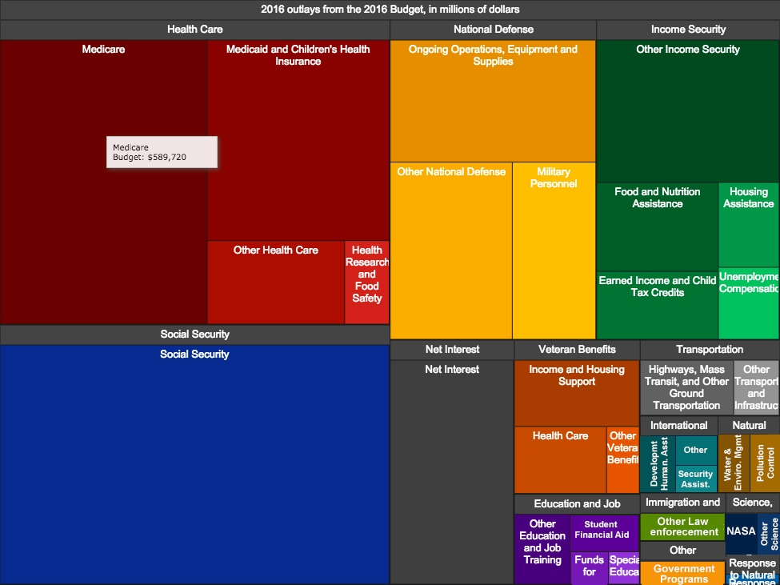
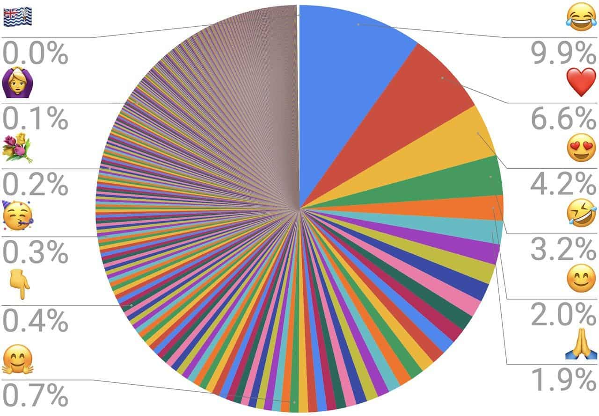

```{r setup, include=FALSE}
## **DO NOT EDIT THIS CODE CHUNK**
knitr::opts_chunk$set(echo = TRUE)

#run install.packages("cherryblossom") on the console to get the run17 dataset

library(tidyverse)
library(cherryblossom)  
```

## Exercise 1

```{r ex1a, out.width="80%"}
run17 %>%
  filter(event == "10 Mile") %>%
  ggplot(mapping = aes(x = age)) +
    geom_histogram(binwidth = 2) 
```

The histogram x-axis is age of people run 10 miles and y-axis is count number of the people.THIS REPRESENT the main particepents is young adults (over 20 and less 40 years old)

```{r ex1b, out.width="80%"}
run17 %>%
  filter(event == "5K") %>%
  ggplot(mapping = aes(x = age)) +
  geom_histogram(binwidth = 2)


```

similarity: they are same tendency: most participants are in a range(age \>=20 and age \<=40), there are seldom participants over 60 or lower than 20. young adults is main force in Cherryblossom difference: number of participants in "5k" is much lessr than "10 miles", maximum in "5k" is around 200 but in "10 miles" is around 1500!

## Exercise 2

```{r ex2, out.width = "80%"}
run17 %>% 
  mutate(mins = round(net_sec/60), na.rm = TRUE) -> data1

ggplot(data = data1, 
       mapping = aes(x = sex, y = mins)
       ) + 
  geom_boxplot( ) +
  labs(
    x = "sex of participants",
    y = "costs minutes "
    )


```

In general, female participants cost more time than male participants.

## Exercise 3

```{r ex3, out.width = "80%"}
run17 %>% 
  filter(event == "10 Mile") %>%
  filter(clock_sec - net_sec <= 180 | clock_sec - net_sec >= 23* 60) %>%
  mutate(wave = ifelse(clock_sec-net_sec <= 180, "first","last"))%>%
  mutate(netmin = net_sec/60) -> data2


  ggplot(data = data2, aes(x = age , y = netmin, color = wave))+
  geom_point()+
  geom_smooth(aes(group = wave), method = lm, formula = y ~ x , se = FALSE) +
  labs(
    x = "Runner's Age , in years",
    y = "Race Time, in minutes",
    title = "Scallar Plot of 10 Mile Race,Time Against Age",
    subtitle = "First vs Last wave")+
    scale_color_manual(values = c("first" = "orange", "last" = "forestgreen"))
  


```

## Exercise 4

#### Example of a good data visualisation

```{r ex4_good_viz, echo = FALSE, out.width = "80%"}

```


** US Office of Management and Budget (2016)**, "**Data is beautiful: 10 of the best data visualisation examples from history to today**" [Online]. Available at: **https://www.tableau.com/en-gb/learn/articles/best-beautiful-data-visualization-examples** (Accessed: **3/11/2023**)

The above image presents a good data visualisation because:

-   *reason 1 : clearly color to disringuish different budget spending ways*
-   *Reason 2 : nice proportion of different color to explain the mount spending in different ways *

#### Example of a bad data visualisation

```{r ex4_bad_viz, echo = FALSE, out.width = "80%"}

```


**unkwon**, "**When Data Visualization Really Isn’t Useful (and When It Is)**" [Online]. Available at: **https://www.oldstreetsolutions.com/good-and-bad-data-visualization** (Accessed: **3/11/2023**)

The above image presents a bad data visualisation because:

-   *Reason 1:Devastating destruction of data, almost no readability*
-   *Reason 2:The odd ratio makes most of the variables missing*
